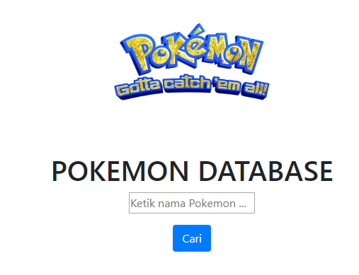
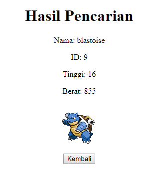
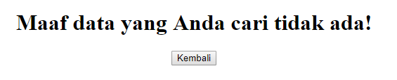

# BEGINNER FLASK APP

Repositori ini merupakan jawaban untuk soal 3 [Ujian Fundamental JCDS04](https://github.com/LintangWisesa/Ujian_Fundamental_JCDS04).

Berisi sebuah aplikasi web yang dibuat menggunakan framework flask. Aplikasi ini terhubung dengan [PokeAPI](https://pokeapi.co/api/v2/pokemon/%7Bnama_Pokemon%7D) yang akan menampilkan profil suatu pokemon.

Tampilan muka dari aplikasi tersebut adalah sebagai berikut:

Saat pengguna memasukan nama Pokemon yang terdapat dalam API maka akan tampil profil seperti berikut:

Bila pokemon yang dicari tidak ada dalam database API maka pengguna akan diarahkan kepada laman berikut:

Selamat mencari Pokemon. 🐱🕵️‍♂️